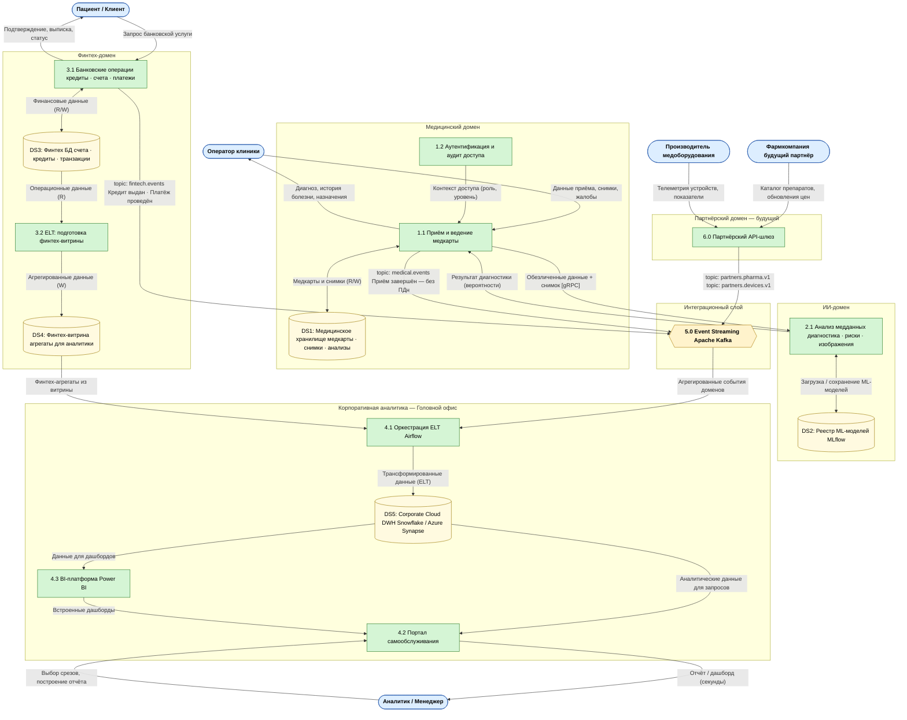
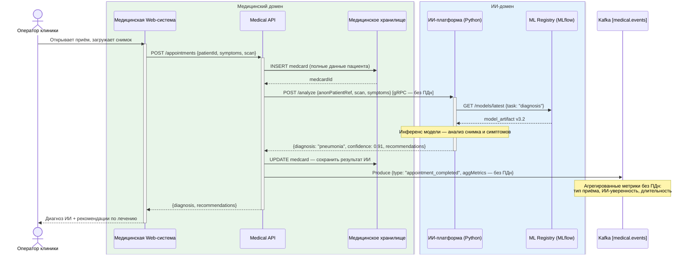
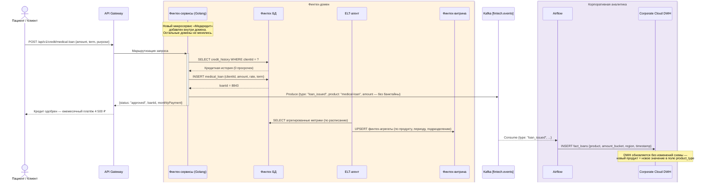
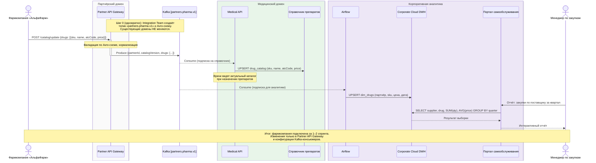
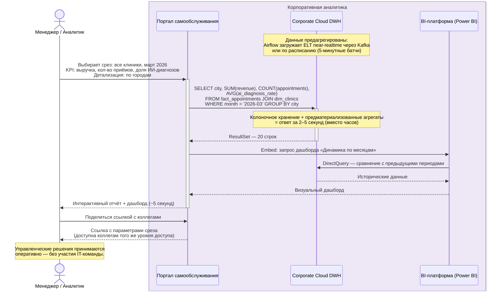

# Диаграммы потоков данных — «Будущее 2.0»

---

## DFD Уровень 1 — Все домены и потоки данных

---

## Сценарий А: ИИ-диагностика пациента

---

## Сценарий Б: Запуск нового финтех-продукта (медицинский кредит)

> Новый продукт добавляется **внутри Финтех-домена** — остальные домены не меняются.

---

## Сценарий В: Подключение новой фармкомпании-партнёра

> Подключение занимает **1–2 спринта**. Существующие домены **не меняются**.

---

## Сценарий Г: Быстрая подготовка управленческого отчёта

> Отчёт готов за **~5 секунд** вместо часов на монолитном DWH.

