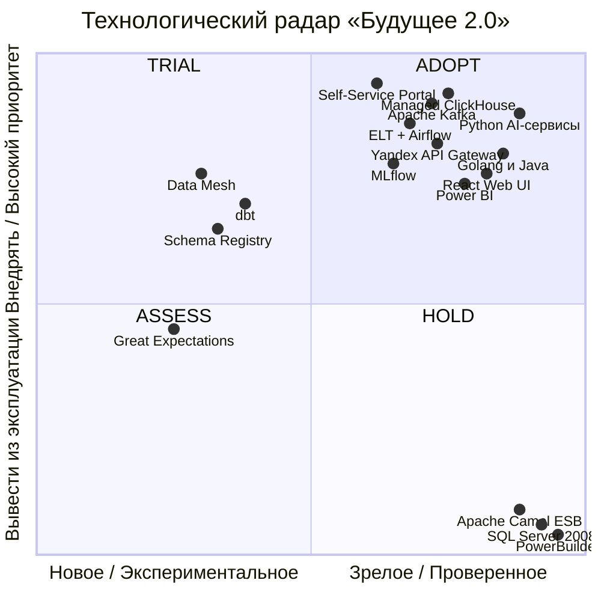
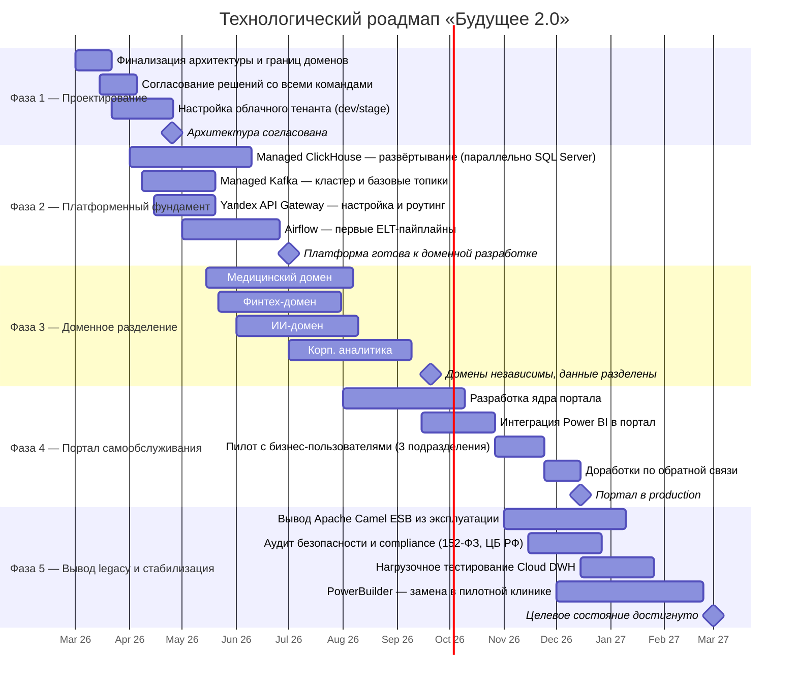

# Задание 3 — Технический радар и роадмап «Будущее 2.0»

---

## Часть 1. Технический радар

### Визуальная карта технологий

Оси:
- **X (горизонталь):** Новое/Экспериментальное → Зрелое/Проверенное
- **Y (вертикаль):** Вывести из эксплуатации → Внедрять/Приоритет

| Квадрант | Значение |
|---|---|
| **ADOPT** (верхний правый) | Зрелая технология с высокой стратегической ценностью — применять |
| **TRIAL** (верхний левый) | Новая технология с высоким потенциалом — пробовать |
| **ASSESS** (нижний левый) | Новая технология, перспективна — изучить и оценить |
| **HOLD** (нижний правый) | Устаревшая технология с низкой ценностью — вывести из эксплуатации |

---

### Детализация по квадрантам

#### ADOPT — Применять

| Технология / Методология | Категория | Бизнес-сценарий |
|---|---|---|
| **Managed ClickHouse** (Yandex Cloud) | Платформа | Быстрая отчётность: запросы за секунды вместо часов; колоночное хранение, сжатие 3–5×, горизонтальное масштабирование |
| **Apache Kafka** (Yandex Managed Kafka) | Платформа | Интеграция новых бизнесов без изменения DWH; асинхронная связь доменов |
| **Apache Airflow** | Инструмент | Оркестрация ELT-пайплайнов; надёжная загрузка данных из всех доменов в ClickHouse DWH |
| **Self-Service Portal** | Продукт | Портал самообслуживания — прямой доступ аналитиков к данным без участия IT |
| **Yandex API Gateway** | Платформа | Единая точка входа; аутентификация и авторизация для всех доменных API |
| **MLflow** | Инструмент | Версионирование и аудит ML-моделей; соответствие регуляторным требованиям для ИИ-диагностики |
| **ELT-подход** (вместо ETL) | Техника | Трансформации внутри Cloud DWH — выше производительность, проще поддержка |
| **Domain-Driven Design (DDD)** | Техника | Фундамент доменного разделения; независимость команд и систем |
| **Event-Driven Architecture** | Техника | Слабая связность доменов; масштабирование без изменения существующих систем |
| **Python** (AI/ML) | Язык/Фреймворк | ИИ-диагностика; ML-пайплайны — уже в производстве, расширять |
| **Golang / Java** (Финтех) | Язык/Фреймворк | Высокопроизводительные банковские операции — уже в производстве, продолжать |
| **React** (Web UI) | Язык/Фреймворк | Замена PowerBuilder; современный интерфейс для операторов клиник |
| **Spring Boot** / FastAPI | Язык/Фреймворк | Domain API-слой (Medical API, Partner API) |
| **Power BI** (обновлённый) | Инструмент | Дашборды для менеджмента; встраивание в Self-Service Portal через Embed API |
| **RBAC** (Role-Based Access Control) | Техника | Разграничение доступа в портале: каждый сотрудник видит только свой уровень данных |

#### TRIAL — Пробовать

| Технология / Методология | Категория | Бизнес-сценарий |
|---|---|---|
| **Data Mesh** (полная реализация) | Техника | Масштабирование при добавлении ≥3 новых бизнесов (фарма, оборудование); полная автономия доменов |
| **dbt** (data build tool) | Инструмент | Управление ELT-трансформациями в Cloud DWH как кодом; тестирование и документация данных |
| **Schema Registry** (Confluent) | Инструмент | Формализация контрактов данных между доменами в Kafka; предотвращение несовместимых изменений |

#### ASSESS — Оценить

| Технология / Методология | Категория | Бизнес-сценарий |
|---|---|---|
| **Great Expectations** / dbt tests | Инструмент | Автоматическая проверка качества данных в ELT-пайплайнах; снижение риска некорректной отчётности |
| **OpenLineage** / Apache Atlas | Инструмент | Data lineage — отслеживание происхождения данных для аудита и compliance |

#### HOLD — Вывести из эксплуатации

| Технология | Категория | Причина вывода | Пострадавшие сценарии (если оставить) |
|---|---|---|---|
| **Microsoft SQL Server 2008** | Платформа | Нет патчей безопасности с 2019 г.; нет горизонтального масштабирования; монолитная бизнес-логика | Безопасность данных, масштабирование аналитики, подключение новых бизнесов |
| **PowerBuilder** | Язык/Фреймворк | Нет разработчиков на рынке; нет интеграции с современными API; высокие затраты на доработки | Эффективность операторов клиник, time-to-market новых функций |
| **Apache Camel ESB** (монолитный) | Платформа | Единая точка отказа; добавление нового источника требует изменения центрального конфига | Масштабирование интеграции, подключение партнёров |
| **ETL-подход** (трансформации до загрузки) | Техника | Медленнее ELT; не использует вычислительные мощности Cloud DWH | Скорость загрузки данных, time-to-insight |

---

## Часть 2. Роадмап (март 2026 — март 2027)

---

## Часть 3. Описание этапов: результаты, команды, ресурсы

### Фаза 1 — Проектирование (март — апрель 2026)

| Параметр | Содержание |
|---|---|
| **Ключевые задачи** | Финализация целевой архитектуры; определение и согласование границ доменов; выбор Yandex Cloud как облачного провайдера; настройка базового тенанта в Yandex Cloud (dev/stage среды через Terraform) |
| **Ожидаемые результаты** | Согласованная архитектура C4; описанные домены с владельцами; работающий dev-тенант в Yandex Cloud (`terraform apply`); ADR (Architecture Decision Records) по ключевым решениям |
| **Ответственные команды** | Главный архитектор, Tech Lead каждого домена, CISO |
| **Ресурсы** | 2 архитектора × 2 мес.; облачный аккаунт (dev/stage tier) |

**Бизнес-обоснование:** Без согласованной архитектуры каждая команда будет двигаться в своём направлении. Инвестиция в 2 месяца проектирования предотвращает переделки стоимостью 6–12 месяцев работы. Именно на этом этапе достигается промежуточная бизнес-цель: «архитектурное решение по трансформации сформировано и согласовано».

---

### Фаза 2 — Платформенный фундамент (апрель — июль 2026)

| Параметр | Содержание |
|---|---|
| **Ключевые задачи** | Развернуть Managed ClickHouse (Corporate DWH) параллельно SQL Server 2008 (без отключения legacy); поднять Managed Kafka с базовыми топиками; настроить Yandex API Gateway; создать первые ELT-пайплайны в Airflow |
| **Ожидаемые результаты** | Работающий ClickHouse DWH с первыми таблицами; Managed Kafka с топиками `medical-events`, `fintech-events`; Yandex API Gateway с роутингом `/medical`, `/fintech`; первый ELT-пайплайн загружает данные в DWH за минуты |
| **Ответственные команды** | Platform/Infrastructure team, DBA team, Integration team |
| **Ресурсы** | 4–5 инженеров платформы × 3 мес.; Managed ClickHouse: `s2.micro` в dev, `s2.medium+` в prod; Managed Kafka: `s2.micro`, 20 GB SSD |

**Бизнес-обоснование:** Фундаментальный этап — без него невозможны ни доменное разделение, ни портал. ClickHouse решает проблему P2 (отчётность часами): колоночное хранение даёт ускорение GROUP BY / агрегаций в 10–100× по сравнению с SQL Server 2008. Kafka устраняет ESB как узкое место, что напрямую влияет на time-to-market новых продуктов.

---

### Фаза 3 — Доменное разделение (май — сентябрь 2026)

| Параметр | Содержание |
|---|---|
| **Ключевые задачи** | **Медицинский домен:** создать Medical API как единственную точку доступа к медданным; физически изолировать Object Storage (медицинский Data Lake); перевести ИИ-сервисы с прямого доступа к DWH на Medical API. **Финтех-домен:** создать отдельную Managed PostgreSQL; подключить финтех-события к Managed Kafka. **ИИ-домен:** внедрить MLflow для версионирования моделей; добавить audit-логирование в Yandex Cloud Logging. **Корп. аналитика:** наполнить Managed ClickHouse агрегированными данными через Airflow-пайплайны |
| **Ожидаемые результаты** | Каждый домен владеет своими данными; Medical API — единственный путь к медданным; Managed Kafka публикует события всех доменов; Managed ClickHouse содержит актуальные агрегаты; ИИ-модели версионируются в MLflow |
| **Ответственные команды** | Medical team (клиники), Fintech team (банк), AI team (ИИ-компания), Analytics team (HQ) |
| **Ресурсы** | 3–4 разработчика в каждом домене × 4 мес.; отдельные облачные среды для каждого домена |

**Бизнес-обоснование:** Этот этап напрямую обеспечивает два ключевых результата бизнеса: (1) **независимое развитие финтех и ИИ** — команды перестают ждать друг друга и DWH-команду; (2) **регуляторное соответствие** — медицинские данные физически изолированы в Object Storage с versioning, что устраняет риск штрафов по 152-ФЗ и возможного отзыва банковской лицензии. Финтех-домен получает возможность деплоить новые продукты независимо, сократив time-to-market с недель до дней.

---

### Фаза 4 — Портал самообслуживания (август — декабрь 2026)

| Параметр | Содержание |
|---|---|
| **Ключевые задачи** | Разработать ядро портала (веб-приложение с конструктором отчётов); интегрировать с Cloud DWH через SQL API; встроить Power BI через Embed API; настроить RBAC (разграничение по доменам и уровням доступа); провести пилот с 3 подразделениями; доработать по обратной связи |
| **Ожидаемые результаты** | Работающий портал самообслуживания; аналитики строят отчёты без участия IT; отчёты формируются за секунды; каждый сотрудник видит только данные своего уровня доступа; 3 подразделения подтвердили ценность |
| **Ответственные команды** | Analytics team (HQ), Portal dev team (2–3 frontend + 2 backend), Product Owner |
| **Ресурсы** | 5–6 разработчиков × 5 мес.; Power BI Premium лицензии; UX-дизайнер × 2 мес. |

**Бизнес-обоснование:** Это **прямая цель бизнеса**, поставленная руководством. Портал устраняет очередь аналитических запросов к IT (проблема P7) и переводит принятие управленческих решений из режима «ждать часами/днями» в режим «получить ответ за секунды». Финансовый эффект: сокращение нагрузки на IT-аналитиков на 40–60%; ускорение принятия решений о новых продуктах и корректировке стратегии.

---

### Фаза 5 — Вывод legacy и стабилизация (ноябрь 2026 — март 2027)

| Параметр | Содержание |
|---|---|
| **Ключевые задачи** | Вывести Apache Camel ESB (все потоки переведены на Kafka); провести аудит информационной безопасности по 152-ФЗ и требованиям ЦБ РФ; нагрузочное тестирование Cloud DWH под полной нагрузкой; заменить PowerBuilder в пилотной клинике на React Web UI |
| **Ожидаемые результаты** | ESB выведен, больше нет единой точки отказа в интеграции; пройден регуляторный аудит; Cloud DWH стабильно работает под нагрузкой сотен ТБ; 1 клиника переведена на новый UI (подтверждён ROI) |
| **Ответственные команды** | Integration team (вывод ESB), CISO (аудит), Platform team (нагрузочное тестирование), Medical team (пилот нового UI) |
| **Ресурсы** | 2 инженера интеграции × 3 мес.; внешний аудитор (безопасность, compliance); 2 QA-инженера × 2 мес.; 2 fullstack-разработчика × 3 мес. (новый UI) |

**Бизнес-обоснование:** Вывод ESB снижает операционные риски — больше нет единственной точки отказа, которая может остановить интеграцию всех систем. Compliance-аудит критичен для банковской лицензии и работы с медицинскими данными: без него бизнес несёт регуляторный риск. Пилот замены PowerBuilder проверяет ROI перед масштабным переходом: если операторы работают эффективнее, полная замена запускается в следующем году.

---

## Итоговая связь этапов с бизнес-целями

| Бизнес-цель | Фаза 1 | Фаза 2 | Фаза 3 | Фаза 4 | Фаза 5 |
|---|:---:|:---:|:---:|:---:|:---:|
| **Быстрая отчётность** | Проект | ClickHouse + ELT | Витрины данных | Портал | Стабилизация DWH |
| **Независимость финтех** | Границы доменов | Managed Kafka + API GW | Изоляция PostgreSQL | — | Вывод ESB |
| **Независимость ИИ** | Границы доменов | Yandex API GW | Medical API + MLflow | — | — |
| **Портал самообслуживания** | — | Managed ClickHouse | Агрегаты | **Портал** | — |
| **Новые партнёры (фарма)** | — | Kafka | Partner API шаблон | — | — |
| **Регуляторное соответствие** | DDD + изоляция | — | Физическая изоляция | RBAC | Аудит |
| **Снижение затрат на legacy** | Решение о выводе | Параллельная работа | — | — | Вывод ESB, пилот UI |
| **Качество мед. сервисов** | — | — | ИИ-домен + MLflow | — | Новый UI оператора |
