# Диаграмма автоматизации развёртывания — «Будущее 2.0» (Yandex Cloud)

## Легенда

| Стиль | Значение |
|---|---|
| Зелёный (terraform) | Ресурс управляется Terraform (yandex-cloud/yandex провайдер) |
| Оранжевый (manual) | Развёртывается или настраивается вручную |

---

## Компонентная схема

```mermaid
flowchart TB
    %% ── Внешний мир ─────────────────────────────────────────────
    INTERNET(["Интернет"])
    DNS_YC(["DNS-делегация\n(ручная, у регистратора)"]):::manual

    %% ── Ручное развёртывание ─────────────────────────────────────
    subgraph MANUAL["Ручное развёртывание / настройка"]
        direction LR
        IAM_ROLES["Назначение ролей IAM\n(identity team)"]:::manual
        LEGACY_ESB["Apache Camel ESB\n(вывод из эксплуатации)"]:::manual
        LEGACY_PB["PowerBuilder UI\n(вывод из эксплуатации)"]:::manual
        DATA_MIG["Первичная миграция данных\nиз SQL Server 2008"]:::manual
        SQL2008[("SQL Server 2008\nDWH Legacy")]:::manual
    end

    %% ── Yandex Cloud ─────────────────────────────────────────────
    subgraph YC["Yandex Cloud — управляется Terraform"]
        direction TB

        %% ── Мониторинг ──────────────────────────────────────────
        LOGS["Cloud Logging Group\nyandex_logging_group"]:::tf

        %% ── Секреты ─────────────────────────────────────────────
        subgraph SEC["Безопасность"]
            LB_PG["Lockbox: pg-password\nyandex_lockbox_secret"]:::tf
            LB_CH["Lockbox: ch-password\nyandex_lockbox_secret"]:::tf
        end

        %% ── Сетевой уровень ──────────────────────────────────────
        subgraph NET["Сетевой уровень"]
            direction TB
            VPC["VPC Network\nyandex_vpc_network"]:::tf
            NAT_GW["NAT Gateway\nyandex_vpc_gateway\n+ route_table"]:::tf

            subgraph SUBNETS["Подсети по доменам"]
                direction LR
                S_MED["medical-subnet\n10.0.1.0/24"]:::tf
                S_FIN["fintech-subnet\n10.0.2.0/24"]:::tf
                S_AI["ai-subnet\n10.0.3.0/24"]:::tf
                S_ANA["analytics-subnet\n10.0.4.0/24"]:::tf
                S_K8S["k8s-subnet\n10.0.8.0/22"]:::tf
                S_INT["integration-subnet\n10.0.20.0/24"]:::tf
            end

            subgraph SGS["Security Groups"]
                direction LR
                SG_MED["SG Medical\nТолько k8s → :8080"]:::tf
                SG_FIN["SG Fintech\nТолько k8s → :8080, :5432"]:::tf
            end
        end

        %% ── Compute ─────────────────────────────────────────────
        subgraph COMPUTE["Вычислительный уровень"]
            direction TB

            subgraph DISKS["yandex_compute_disk"]
                DSK_MED["medical-api-disk\nnetwork-ssd, 15 GB\nUbuntu 22.04"]:::tf
                DSK_FIN["fintech-api-disk\nnetwork-ssd, 15 GB\nUbuntu 22.04"]:::tf
            end

            subgraph VMS["yandex_compute_instance"]
                VM_MED["medical-api VM\n2 vCPU · 4 GB RAM\nnat=false"]:::tf
                VM_FIN["fintech-api VM\n2 vCPU · 4 GB RAM\nnat=false"]:::tf
            end

            REG["Container Registry\nyandex_container_registry"]:::tf

            subgraph K8S["Managed Kubernetes\nyandex_kubernetes_cluster"]
                K8S_SYS["System Node Group\n4 vCPU · 16 GB · ×2"]:::tf
                K8S_AI["AI Node Group\n8 vCPU · 32 GB · ×1\ntaint: ai"]:::tf
            end

            subgraph SA["Service Accounts"]
                SA_K8S["yandex_iam_service_account\nk8s-sa"]:::tf
                SA_NODE["yandex_iam_service_account\nk8s-nodes-sa"]:::tf
            end
        end

        %% ── Интеграционный слой ──────────────────────────────────
        subgraph INT["Интеграционный слой"]
            APIGW["API Gateway\nyandex_api_gateway\n/medical · /fintech · /health"]:::tf

            subgraph KAFKA["Managed Kafka\nyandex_mdb_kafka_cluster"]
                TPC_MED["topic: medical-events\n4 partitions"]:::tf
                TPC_FIN["topic: fintech-events\n4 partitions"]:::tf
                TPC_PH["topic: partners-pharma-v1\n2 partitions"]:::tf
                TPC_DV["topic: partners-devices-v1\n2 partitions"]:::tf
            end
        end

        %% ── Слой данных ──────────────────────────────────────────
        subgraph DATA["Слой данных"]
            direction TB

            subgraph MED_STORE["Медицинское хранилище"]
                OBJ["Object Storage\nyandex_storage_bucket\nшифрование + versioning"]:::tf
            end

            subgraph CORP_DWH["Corporate Cloud DWH"]
                CH["Managed ClickHouse\nyandex_mdb_clickhouse_cluster\nБД: corporatedwh"]:::tf
            end

            subgraph FIN_DB["Финтех-домен"]
                PG["Managed PostgreSQL\nyandex_mdb_postgresql_cluster\nv15 · БД: fintechdb"]:::tf
            end
        end
    end

    %% ── Связи: внешний мир ───────────────────────────────────────
    INTERNET --> APIGW
    DNS_YC -.->|"ручная настройка"| APIGW

    %% ── Связи: сеть ─────────────────────────────────────────────
    VPC --> SUBNETS
    NAT_GW --> S_K8S
    NAT_GW --> S_INT
    S_MED --> SG_MED
    S_FIN --> SG_FIN

    %% ── Связи: диски → VM (паттерн из учебного примера) ─────────
    DSK_MED --> VM_MED
    DSK_FIN --> VM_FIN

    %% ── Связи: VM → подсети ──────────────────────────────────────
    VM_MED --> S_MED
    VM_FIN --> S_FIN

    %% ── Связи: API Gateway → VM ──────────────────────────────────
    APIGW --> VM_MED
    APIGW --> VM_FIN

    %% ── Связи: k8s ───────────────────────────────────────────────
    SA_K8S --> K8S
    SA_NODE --> K8S
    REG --> K8S

    %% ── Связи: k8s → данные ──────────────────────────────────────
    K8S --> KAFKA
    K8S --> OBJ
    K8S --> PG
    K8S --> CH

    %% ── Связи: мониторинг ────────────────────────────────────────
    K8S -.-> LOGS
    APIGW -.-> LOGS

    %% ── Связи: legacy (ручные) ───────────────────────────────────
    SQL2008 -.->|"ручная миграция"| DATA_MIG
    DATA_MIG -.->|"загрузка в ClickHouse DWH"| CH
    LEGACY_ESB -.->|"вывод → заменить Kafka"| KAFKA
    IAM_ROLES -.->|"назначение ролей"| YC

    %% ── Стили ───────────────────────────────────────────────────
    classDef tf     fill:#D5F5D5,stroke:#227722,color:#000
    classDef manual fill:#FFE0B2,stroke:#E65100,color:#000
```

---

## Итоговая таблица компонентов

| Компонент | Yandex Cloud ресурс | Управление|
|---|---|---|
| VPC Network + Subnets | `yandex_vpc_network` / `yandex_vpc_subnet` | **Terraform** |
| NAT Gateway + Route Table | `yandex_vpc_gateway` + `yandex_vpc_route_table` | **Terraform** |
| Security Groups | `yandex_vpc_security_group` | **Terraform** |
| Compute Disk (×2) | `yandex_compute_disk` | **Terraform** |
| Compute Instance (×2) | `yandex_compute_instance` | **Terraform** |
| Cloud Logging | `yandex_logging_group` | **Terraform** |
| Lockbox Secrets | `yandex_lockbox_secret` | **Terraform** |
| Container Registry | `yandex_container_registry` | **Terraform** | 
| IAM Service Accounts | `yandex_iam_service_account` | **Terraform** | 
| Managed Kafka + Topics | `yandex_mdb_kafka_cluster` / `yandex_mdb_kafka_topic` | **Terraform** | 
| Object Storage | `yandex_storage_bucket` | **Terraform** | 
| Managed ClickHouse | `yandex_mdb_clickhouse_cluster` | **Terraform** | 
| Managed PostgreSQL | `yandex_mdb_postgresql_cluster` | **Terraform** |
| Managed Kubernetes | `yandex_kubernetes_cluster` + node groups | **Terraform** | 
| API Gateway | `yandex_api_gateway` | **Terraform** | 
| **DNS-делегация** | — | **Вручную** | 
| **IAM-роли команд** | — | **Вручную** | 
| **Миграция из SQL Server 2008** | — | **Вручную** | 
| **SQL Server 2008 (legacy)** | — | **Вручную** | 
| **PowerBuilder + ESB (legacy)** | — | **Вручную** | 
